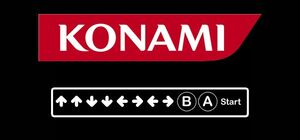

# Konami Code JS module
## `@shgysk8zer0/konami`
<script type="module" src="./index.js" crossorigin="anonymous" referrerpolicy="no-referrer"></script>
[](https://github.com/shgysk8zer0/konami/blob/master/LICENSE)
[](https://github.com/shgysk8zer0/konami/commits/master)
[](https://github.com/shgysk8zer0/konami/releases)
[](https://github.com/sponsors/shgysk8zer0)

[](https://www.npmjs.com/package/@shgysk8zer0/konami)


[](https://www.npmjs.com/package/@shgysk8zer0/konami)

[](https://github.com/shgysk8zer0)


[](https://twitter.com/shgysk8zer0)

[](https://liberapay.com/shgysk8zer0/donate "Donate using Liberapay")



> The Konami Code (Japanese: コナミコマンド, Konami Komando, "Konami command"), also
> commonly referred to as the Contra Code and sometimes the 30 Lives code,
> is a cheat code that appears in many Konami video games, as well as some
> non-Konami games. In the original code, the player has to press the
> following sequence of buttons on the game controller to enable a cheat or other
> effects:
>
> `↑ ↑ ↓ ↓ ← → ← → B A`; sometimes Start and/or Select is added to the sequence
> (usually to start Single player or, Two player modes).
> ~[Konami Code | Wikipedia](https://en.wikipedia.org/wiki/Konami_Code)

## Quick Links
- [About](#about)
- [Installation](#installation)
- [Updating](#updating)
- [Example](#example)
- [Requirements](#requirements)
- [Supported Browsers](#supported-browsers)
- [@shgysk8zer0/konami on npm](https://www.npmjs.com/package/@shgysk8zer0/konami)
- [@shgysk8zer0/konami on unpkg](https://unpkg.com/browse/@shgysk8zer0/konami/)
- [Issues](https://github.com/shgysk8zer0/konami/issues)

### About
`konami.js` enables developers to easily add the Konami Code to their websites.
Like other JavaScript solutions, this one adds keyboard listeners and waits
for the specifc sequence of keys to be pressed. Unlike other solutions, however,
this one:
- Is a [JavaScript module](https://developer.mozilla.org/en-US/docs/Web/JavaScript/Guide/Modules)
that may be `import`ed
- Returns a `Promise` that resolves when the correct sequence is entered and
may be `await`ed
- Supports [`AbortSignal`](https://developer.mozilla.org/en-US/docs/Web/API/AbortSignal)
- Allows specifying the `EventTarget` via the optional `{ target }`.

### Installation
#### npm

```bash
npm i @shgysk8zer0/konami
```

#### Git Submodule
```bash
git submodule add https://github/com/shgysk8zer0/konami.git js/konami
```

### Updating

#### Git Submodule
```bash
git submodule update --remote -- js/konami
```

**Tip**: Use [Dependabot](https://github.com/dependabot) to automatically get
Pull Requests when a submodule or package is updated.

### Example

#### From Submodule
```js
import { konami } from './konami.js';

konami().then(/* Enter Cheat Mode! */);
```

#### From npm
```js

import { konami } from '@shgysk8zer0/konami';
// or const { konami } = require('@shgysk8zer0/konami');

konami().then(/* Enter Cheat Mode! */);
```

### Advanced

#### From unpkg CDN
```js
const controller = new AbortController();
// This will use version 1.0.3
const { konami } = await import('https://unpkg.com/@shgysk8zer0/konami@1.0.3/konami.js');

try {
  await konami({
    delay: 500,
    target: document.getElementById('konami-target'),
    signal: controller.signal,
    capture: true,
  });

  /* Enter Cheat Mode! */
} catch(err) {
  // Signal was aborted
}
```

### Requirements
Due to use of `signal`, support is currently limited to browsers supporting
`AbortSignal` & `AbortController`. Support may be extended to other browser by
importing a polyfill.

### Supported Browsers

| Browser           | Supported | Version | Released   |
--------------------|-----------|---------|------------
| Internet Explorer | 𐄂         |         |            |
| Edge              | ✓         | 16      | 2017-10-16 |
| Safari            | ✓         | 12.1    | 2019-03-24 |
| Chrome            | ✓         | 66      | 2018-04-16 |
| Firefox           | ✓         | 57      | 2017-11-13 |
| Node              | ✓         | 15      | ?          |
| Deno              | ✓         | 1.0     | ?          |
